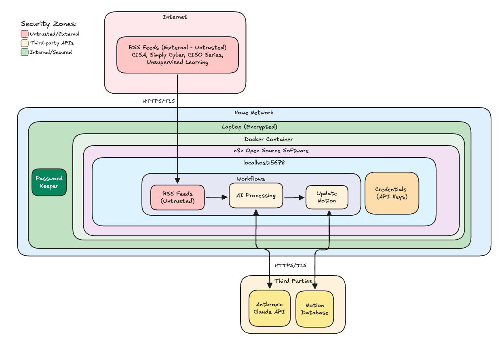

# Cybersecurity Risk Assessment

## Contents
- [Executive Summary](#executive-summary)
- [1. Requestor Information](#1-requestor-information)
- [2. Business Objective](#2-business-objective)
- [3. Architecture & Deployment Details](#3-architecture--deployment-details)
  - [Components](#components)
  - [Data Flow Diagram](#data-flow-diagram)
  - [Assets](#assets)
- [4. GOVERN (GV) - Governance & Risk Strategy](#4-govern-gv---governance--risk-strategy)
  - [4.1 Organizational Context (GV.OC)](#41-organizational-context-gvoc)
  - [4.2 Policy (GV.PO)](#42-policy-gvpo)
  - [4.4 Supply Chain Risk Management (GV.SC)](#44-supply-chain-risk-management-gvsc)
- [5. IDENTIFY (ID) - Asset Management & Risk Assessment](#5-identify-id---asset-management--risk-assessment)
  - [5.1 Asset Management (ID.AM)](#51-asset-management-idam)
  - [5.2 Risk Assessment (ID.RA)](#52-risk-assessment-idra)
- [6. PROTECT (PR) - Security Controls](#6-protect-pr---security-controls)
  - [6.1 Identity Management & Access Control (PR.AA)](#61-identity-management--access-control-praa)
  - [6.2 Data Security (PR.DS)](#62-data-security-prds)
  - [6.3 Platform Security (PR.PS)](#63-platform-security-prps)
  - [6.4 Infrastructure Resilience (PR.IR)](#64-infrastructure-resilience-prir)
- [7. DETECT (DE) - Monitoring & Detection](#7-detect-de---monitoring--detection)
  - [7.1 Continuous Monitoring (DE.CM)](#71-continuous-monitoring-decm)
  - [7.2 Adverse Event Analysis (DE.AE)](#72-adverse-event-analysis-deae)
- [8. RESPOND (RS) - Incident Response](#8-respond-rs---incident-response)
  - [8.1 Incident Management (RS.MA)](#81-incident-management-rsma)
  - [8.2 Incident Analysis (RS.AN)](#82-incident-analysis-rsan)
- [9. RECOVER (RC) - Recovery & Resilience](#9-recover-rc---recovery--resilience)
  - [9.1 Recovery Planning (RC.RP)](#91-recovery-planning-rcrp)
- [10. Deployment Model Comparison](#10-deployment-model-comparison)
- [11. Risk Assessment](#11-risk-assessment)
  - [Threat Scenarios](#threat-scenarios)
  - [Risk Matrix](#risk-matrix)
- [12. Action Items](#12-action-items)
  - [Completed Security Hardening](#completed-security-hardening)
  - [Option A: Additional VM Hardening](#option-a-additional-vm-hardening)
  - [Option B: n8n Cloud Migration](#option-b-n8n-cloud-migration-85-risk-reduction)
  - [Remaining Security Enhancements](#remaining-security-enhancements)
- [Risk Assessment Approval](#risk-assessment-approval)

---

### Executive Summary

**Application:** GRC News Assistant 3.0 - n8n Workflow Automation with AI Integration  
**Assessment Date:** November 23, 2025  
**Last Updated:** November 30, 2025  
**Assessment Type:**
- [X] Initial
- [X] Change-Triggered (Security Hardening Implementation)
- [ ] Periodic

**Current Deployment Model:**
- [X] Self-hosted (Hardened Docker in Kali VM)
- [ ] Cloud
- [ ] Hybrid

**Design:**
- [ ] **Sensitive data access** (databases, APIs, files): Public data - news articles, private Notion Database but no sensitive data inside
- [X] **Untrusted input** (webhooks, emails, public APIs): No webhook, email or chat input, but public RSS feeds and blog/news content that could contain malicious payloads
- [X] **External communication** (HTTP requests, emails): Fetch content from RSS feed URLs, Anthropic API for processing, Notion API for database storage

---

### Deployment Options Risk Comparison

| Deployment Model | Risk Reduction | Current Residual Risk | Key Characteristics |
|-----------------|----------------|----------------------|---------------------|
| **Stock Docker on Mac** | ~40-50% | **MODERATE** | Basic container isolation, shared host kernel, no pre-deployment scanning |
| **Hardened Docker in Kali VM** ✓ | ~75-80% | **LOW** | VM isolation + hardened containers + pre-deployment scanning + prompt injection defenses |
| **n8n Cloud (SaaS)** | ~85% | **LOW** | Professional security controls, managed infrastructure, no localhost exposure |

---

### Current Deployment: Hardened Docker in Kali VM

**Implemented Security Controls:**
- Pre-deployment vulnerability scanning (Docker Scout)
- Non-root container execution (`user: "1000:1000"`)
- Read-only root filesystem (`read_only: true`)
- All Linux capabilities dropped (`cap_drop: ALL`)
- Privilege escalation blocked (`no-new-privileges`)
- Resource limits (CPU/memory caps)
- Dual network isolation (internal DB network)
- Secrets management via environment file
- Prompt injection defenses (3 layers)
- VM-level isolation from host system

**Current Residual Risk:** **LOW** - The combination of VM isolation, hardened Docker containers, pre-deployment vulnerability scanning, and prompt injection defenses provides defense-in-depth that significantly reduces attack surface and limits blast radius of potential compromises.

---

### 1. Requestor Information

|Field|Details|
|---|---|
|Name, Title|Steve, GRC Practitioner|
|Department|Governance, Risk & Compliance|
|Business Sponsor|N/A|

### 2. Business Objective

**Purpose:** Automate the collection, analysis, and prioritization of cybersecurity news and advisories to enhance threat awareness and generate security awareness training content.

**Scope:** Daily automated processing of RSS feeds from trusted cybersecurity sources (Simply Cyber, CISA Advisories, Daniel Miessler's Unsupervised Learning, CISO Series) through AI-powered analysis and storage in Notion database for team consumption.

## 3. Architecture & Deployment Details

### Components


https://app.excalidraw.com/l/1U6BgkXrdYQ/1NxRV12zBlm

|Component|Type|Location|Description|
|---|---|---|---|
|Kali Linux VM|Virtual Machine|VirtualBox on Host|Isolated environment with NAT networking|
|n8n Server|Workflow Automation|Hardened Docker Container (localhost:5678)|Core automation platform with security hardening|
|PostgreSQL|Database|Hardened Docker Container (internal network)|Persistent storage with network isolation|
|Redis|Cache|Hardened Docker Container (internal network)|Queue management with network isolation|
|Docker Host|Container Runtime|Kali Linux VM|Docker Engine with hardened compose configuration|
|Anthropic API|AI Service|Cloud (External)|Claude AI models for content cleaning and analysis|
|Notion API|Database Service|Cloud (External)|Document database for storing processed articles|
|RSS Feed Sources|Content Sources|External|4 cybersecurity news feeds providing input data|
|Schedule Trigger|Automation Component|n8n Internal|Daily execution at 5:00 AM|

### Data Flow Diagram


```
RSS Feeds → Date Filter → Content Extraction → HTTP GET →
→ HTML to Markdown → Guardrails Check → AI Text Cleaning → AI Labeling/Rating →
→ Output Validation → JSON Processing → Notion Database Storage
```

### Assets

|Asset Name|Description|Data Classification*|
|---|---|---|
|RSS Feed Content|Public cybersecurity news and advisories|Public|
|Anthropic API Key|Authentication credential for Claude AI|Confidential|
|Notion API Token|Authentication credential for database access|Confidential|
|Processed Articles|Analyzed and rated GRC content with metadata|Internal Use|
|AI Prompts|Custom prompts for content analysis and labeling|Public|
|Docker Environment File|Contains encrypted credentials and configuration|Confidential|
|VM Snapshots|Point-in-time recovery images|Internal Use|

_*Data Classification Scale: Public → Internal Use → Confidential → Sensitive_


## 4. GOVERN (GV) - Governance & Risk Strategy

### 4.1 Organizational Context (GV.OC)

|#|Question|Yes (Lower Risk)|No (Higher Risk)|Not Applicable|Comments|
|---|---|---|---|---|---|
|**GV.OC-03**|Are legal, regulatory, and contractual requirements identified for this AI/automation use?|X|||Copyrighted content|

### 4.2 Policy (GV.PO)

|#|Question|Yes (Lower Risk)|No (Higher Risk)|Not Applicable|Comments|
|---|---|---|---|---|---|
|**GV.PO-01**|Is there a formal Acceptable Use Policy governing n8n workflow creation and AI integration?|X||||
|**GV.PO-01**|Does the policy prevent shadow n8n instances across departments?|X||||

### 4.4 Supply Chain Risk Management (GV.SC)

|#|Question|Yes (Lower Risk)|No (Higher Risk)|Not Applicable|Comments|
|---|---|---|---|---|---|
|**GV.SC-02**|Are all LLM providers (OpenAI, Anthropic, etc.) and integrated tools security-vetted?|X|||Anthropic and Notion are established vendors with security programs|
|**GV.SC-02**|Is there a review process before installing community nodes?|||X|No community nodes|
|**GV.SC-03**|Are container images scanned for vulnerabilities before deployment?|X|||Docker Scout integrated into deployment workflow|

## 5. IDENTIFY (ID) - Asset Management & Risk Assessment

### 5.1 Asset Management (ID.AM)

| #            | Question                                                                      | Yes (Lower Risk) | No (Higher Risk) | Not Applicable | Comments |
| ------------ | ----------------------------------------------------------------------------- | ---------------- | ---------------- | -------------- | -------- |
| **ID.AM-03** | Is there a data flow diagram showing all n8n connections to internal systems? | X                |                  |                |          |
| **ID.AM-07** | Is there an inventory of container images and their vulnerability status?     | X                |                  |                | Docker Scout scan results documented |

### 5.2 Risk Assessment (ID.RA)

|#|Question|Yes (Lower Risk)|No (Higher Risk)|Not Applicable|Comments|
|---|---|---|---|---|---|
|**ID.RA-01**|Are vulnerability scans performed on the n8n host regularly?|X|||Docker Scout pre-deployment scanning implemented|
|**ID.RA-02**|Is there a process for reviewing n8n security advisories?||X||Subscribe to n8n security notifications|
|**ID.RA-05**|Are workflows tested against adversarial inputs before production?|X|||Guardrails node with jailbreak/injection detection|
|**ID.RA-06**|Are business logic decisions requiring human judgment identified and excluded from full automation?|X|||Workflow only processes and labels content, no critical decisions|
|**ID.RA-07**|Are workflow changes assessed for security impact?||X||Implement change control process|

## 6. PROTECT (PR) - Security Controls

### 6.1 Identity Management & Access Control (PR.AA)

| #            | Question                                                                                                            | Yes (Lower Risk) | No (Higher Risk) | Not Applicable | Comments                                                  |
| ------------ | ------------------------------------------------------------------------------------------------------------------- | ---------------- | ---------------- | -------------- | --------------------------------------------------------- |
| **PR.AA-01** | Are administrative credentials stored in a password keeper, secret server or key vault - not hard coded into nodes? | X                |                  |                | Credentials stored in n8n credential manager + .env file  |
| **PR.AA-01** | Are n8n API credentials managed in the built-in encrypted credential store?                                         | X                |                  |                | Using encrypted credential store for Anthropic and Notion |
| **PR.AA-01** | Do credentials (API integrations and service accounts) rotate on a defined schedule?                                |                  | X                |                |                                                           |
| **PR.AA-01** | Are webhook endpoints protected with authentication tokens?                                                         |                  |                  | X              | No webhooks in this workflow                              |
| **PR.AA-03** | Is SSO/SAML/OAuth or external authentication (e.g., Entra ID, LDAP) configured for n8n?                             |                  | X                |                | Local authentication only                                 |
| **PR.AA-05** | Is multi-factor authentication required for admin access?                                                           |                  | X                |                |                                                           |
| **PR.AA-06** | Is least privilege and role-based access control implemented for n8n administration and workflow execution?         | X                |                  |                | 1 admin and 1 user                                        |
| **PR.AA-06** | Are repository integrations scoped to specific repos/branches?                                                      |                  |                  | X              | No repository integrations                                |
| **PR.AA-06** | Will AI nodes have read-only access?                                                                                | X                |                  |                | AI only processes content, no write operations            |
| **PR.AA-06** | Do MCP servers require authentication (not anonymous access)?                                                       |                  |                  | X              | No MCP servers in use                                     |
| **PR.AA-06** | Are MCP servers secured with OAuth 2.0 or rotated API keys (not long-lived static credentials)?                     |                  |                  | X              |                                                           |
| **PR.AA-06** | Do MCP servers with OAuth 2.0 or similar token-based authentication have short TTLs?                                |                  |                  | X              |                                                           |

### 6.2 Data Security (PR.DS)

| #            | Question                                                                                    | Yes (Lower Risk) | No (Higher Risk) | Not Applicable | Comments                                                                                                                                                                                    |
| ------------ | ------------------------------------------------------------------------------------------- | ---------------- | ---------------- | -------------- | ------------------------------------------------------------------------------------------------------------------------------------------------------------------------------------------- |
| **PR.DS-01** | Is workflow data encrypted at rest?                                                         | X                |                  |                | FileVault for OS + PostgreSQL in isolated container                                                                                                                                         |
| **PR.DS-02** | Are all AI service connections and integrations secured using HTTPS with TLS 1.2 or higher? | X                |                  |                | All external APIs use HTTPS                                                                                                                                                                 |
| **PR.DS-05** | Are any Data Loss Prevention (DLP) controls in place?                                       |                  | X                |                |                                                                                                                                                                                             |
| **PR.DS-05** | Is there alerting for unusual workflow patterns or data exfiltration?                       |                  | X                |                |                                                                                                                                                                                             |
| **PR.DS-05** | Are prompts sanitized before being sent to LLMs?                                            | X                |                  |                | Guardrails node validates input before AI processing                                                                                                                                        |
| **PR.DS-05** | Is sensitive data masked/redacted/omitted before LLM processing?                            | X                |                  |                | Only public RSS content processed                                                                                                                                                           |
| **PR.DS-05** | Are there guardrails between user inputs and LLM prompts?                                   | X                |                  |                | 3-layer defense: Guardrails node + hardened prompts + output validation                                                                                                                     |
| **PR.DS-05** | Is there protection against data poisoning in shared knowledge bases?                       | X                |                  |                | Read-only RSS sources from trusted providers                                                                                                                                                |
| **PR.DS-11** | Are workflow configurations backed up regularly?                                            | X                |                  |                | VM snapshots + GitHub backup                                                                                                                                                                |
| **PR.DS-11** | Are backups encrypted and stored securely?                                                  | X                |                  |                |                                                                                                                                                                                             |

### 6.3 Platform Security (PR.PS)

| #            | Question                                                           | Yes (Lower Risk) | No (Higher Risk) | Not Applicable | Comments                                 |
| ------------ | ------------------------------------------------------------------ | ---------------- | ---------------- | -------------- | ---------------------------------------- |
| **PR.PS-03** | Has n8n been moved from test to a hardened production environment? | X                |                  |                | Hardened Docker in Kali VM              |
| **PR.PS-02** | Is the n8n application kept up to date with security patches?      |                  | X                |                | Establish patch management process       |
| **PR.PS-01** | Is the host system hardened (e.g to CIS benchmarks)?               | X                |                  |                | Kali VM with hardened Docker containers  |
| **PR.PS-05** | Are execution permissions restricted for workflows?                | X                |                  |                | Non-root execution, capability dropping  |
| **PR.PS-06** | Is code review performed for custom n8n nodes?                     |                  | X                |                | Team of 1                                |
| **PR.PS-05** | Is there rate limiting on LLM API calls per workflow?              |                  | X                |                | Risk of excessive API usage              |
| **PR.PS-01** | Can workflows be quickly disabled/rolled back if compromised?      | X                |                  |                | VM snapshots + workflow disable feature  |
| **PR.PS-01** | Are containers running with security hardening?                    | X                |                  |                | Non-root, read-only FS, no capabilities  |
| **PR.PS-01** | Are container resource limits configured?                          | X                |                  |                | CPU/memory caps prevent DoS/cryptomining |

### 6.4 Infrastructure Resilience (PR.IR)

| #            | Question                                                                                             | Yes (Lower Risk) | No (Higher Risk) | Not Applicable | Comments                                        |
| ------------ | ---------------------------------------------------------------------------------------------------- | ---------------- | ---------------- | -------------- | ----------------------------------------------- |
| **PR.IR-01** | Is n8n only accessible from the corporate network (not internet-facing, and no external web search)? | X                |                  |                | Runs inside VM with NAT networking              |
| **PR.IR-01** | If internet-accessible, is it protected by VPN or zero-trust access?                                 |                  |                  | X              | Not internet-facing, but pulls public RSS feeds |
| **PR.IR-01** | Are IP whitelisting/access control lists configured?                                                 |                  |                  | X              | Local access only within VM                     |
| **PR.IR-01** | Is the n8n interface behind a Web Application Firewall (WAF)?                                        |                  |                  | X              |                                                 |
| **PR.IR-01** | Is database traffic isolated from external networks?                                                 | X                |                  |                | PostgreSQL/Redis on internal-only network       |

## 7. DETECT (DE) - Monitoring & Detection

### 7.1 Continuous Monitoring (DE.CM)

| #            | Question                                                                               | Yes (Lower Risk) | No (Higher Risk) | Not Applicable | Comments            |
| ------------ | -------------------------------------------------------------------------------------- | ---------------- | ---------------- | -------------- | ------------------- |
| **DE.CM-09** | Is an EDR agent installed on the n8n host?                                             | X                |                  |                |                     |
| **DE.CM-01** | Are security events from n8n forwarded to centralized SIEM?                            |                  | X                |                |                     |
| **DE.CM-03** | Is workflow execution activity monitored for anomalies?                                |                  | X                |                |                     |
| **DE.CM-03** | Are failed authentication attempts monitored?                                          |                  | X                |                |                     |
| **DE.CM-09** | Is resource usage (CPU/memory) monitored for crypto-mining?                            | X                |                  |                | Container resource limits prevent abuse |
| **DE.CM-03** | Can LLM prompts/responses be logged without violating privacy regulations?             | X                |                  |                | Public content only |
| **DE.CM-01** | Are there alerts for unusual LLM API usage patterns?                                   |                  | X                |                |                     |
| **DE.CM-03** | Is there monitoring for workflows triggering other workflows excessively?              |                  |                  | X              |                     |
| **DE.CM-09** | Are workflow execution errors and failures monitored and analyzed for security issues? |                  | X                |                |                     |
| **DE.CM-03** | Are prompt injection attempts logged and alerted?                                      | X                |                  |                | Guardrails node logs blocked attempts   |

### 7.2 Adverse Event Analysis (DE.AE)

| #            | Question                                                                     | Yes (Lower Risk) | No (Higher Risk) | Not Applicable | Comments               |
| ------------ | ---------------------------------------------------------------------------- | ---------------- | ---------------- | -------------- | ---------------------- |
| **DE.AE-04** | Can malicious workflow patterns be detected?                                 | X                |                  |                | Guardrails node detection |
| **DE.AE-02** | Are there defined thresholds for abnormal workflow behavior?                 | X                |                  |                | Guardrails thresholds: jailbreak 0.7, injection 0.6, topical 0.5 |
| **DE.AE-02** | Can the system detect prompt injection attempts in logs (if available)?      | X                |                  |                | Guardrails node logs detections |
| **DE.AE-03** | Are there alerts for workflows accessing systems outside their normal scope? |                  | X                |                |                        |

## 8. RESPOND (RS) - Incident Response

### 8.1 Incident Management (RS.MA)

| #            | Question                                                               | Yes (Lower Risk) | No (Higher Risk) | Not Applicable | Comments                              |
| ------------ | ---------------------------------------------------------------------- | ---------------- | ---------------- | -------------- | ------------------------------------- |
| **RS.MA-01** | Is there an incident response plan for compromised workflows?          |                  | X                |                |                                       |
| **RS.MA-03** | Can suspicious workflows be quickly identified and isolated?           | X                |                  |                | n8n workflow disable + VM isolation   |
| **RS.MA-01** | Can you trace prompt injection attacks through the workflow history?   | X                |                  |                | Guardrails logs + n8n execution history |
| **RS.MA-02** | Is there a process to identify and notify affected downstream systems? | X                |                  |                | Only Notion database affected         |

### 8.2 Incident Analysis (RS.AN)

| #            | Question                                                                  | Yes (Lower Risk) | No (Higher Risk) | Not Applicable | Comments |
| ------------ | ------------------------------------------------------------------------- | ---------------- | ---------------- | -------------- | -------- |
| **RS.AN-08** | Are webhook URLs and API endpoints validated?                             | X                |                  |                | Using trusted RSS feeds only |
| **RS.AN-03** | Is there capability to analyze workflow execution history for root cause? | X                |                  |                | n8n provides execution history |

## 9. RECOVER (RC) - Recovery & Resilience

### 9.1 Recovery Planning (RC.RP)

| #            | Question                                                                     | Yes (Lower Risk) | No (Higher Risk) | Not Applicable | Comments                              |
| ------------ | ---------------------------------------------------------------------------- | ---------------- | ---------------- | -------------- | ------------------------------------- |
| **RC.RP-01** | Are workflow backups maintained with version control?                        | X                |                  |                | GitHub + VM snapshots                 |
| **RC.RP-02** | Can compromised workflows be isolated without affecting critical operations? | X                |                  |                | Non-critical news processing workflow |
| **RC.RP-03** | Can the environment be restored to a known-good state quickly?               | X                |                  |                | VM snapshots enable rapid rollback    |

---

## 10. Deployment Model Comparison

### Security Control Comparison

| Security Control | Stock Docker on Mac | Hardened Docker in Kali VM | n8n Cloud (SaaS) |
|-----------------|---------------------|---------------------------|------------------|
| **Pre-deployment vulnerability scanning** | ❌ None | ✅ Docker Scout | ✅ Managed by vendor |
| **Container isolation** | ⚠️ Basic | ✅ Non-root, read-only, no capabilities | ✅ Managed |
| **Host isolation** | ❌ Shared with host OS | ✅ VM provides kernel separation | ✅ Complete isolation |
| **Network isolation** | ❌ Single network | ✅ Dual network (internal DB) | ✅ Managed |
| **Prompt injection defense** | ❌ None | ✅ 3 layers (guardrails, prompts, validation) | ⚠️ Depends on workflow |
| **Secrets management** | ⚠️ Often inline | ✅ Environment file with validation | ✅ Managed vault |
| **Resource limits** | ❌ None | ✅ CPU/memory caps | ✅ Platform limits |
| **Privilege escalation prevention** | ❌ Possible | ✅ Blocked (no-new-privileges) | ✅ Managed |
| **Container escape risk** | ⚠️ Direct host access | ✅ VM boundary limits impact | ✅ Not applicable |
| **Backup/recovery** | ⚠️ Manual | ✅ VM snapshots + GitHub | ✅ Automated |
| **Patch management** | ⚠️ Manual | ⚠️ Manual (but scanned) | ✅ Vendor managed |
| **Compliance controls** | ❌ None | ⚠️ Self-managed | ✅ SOC 2, etc. |

### Risk Reduction Summary

| Deployment Model | Risk Reduction from Baseline | Residual Risk Level |
|-----------------|-----------------------------|--------------------|
| No containerization (bare metal) | 0% (baseline) | **HIGH** |
| Stock Docker on Mac | ~40-50% | **MODERATE** |
| **Hardened Docker in Kali VM** ✓ | **~75-80%** | **LOW** |
| n8n Cloud (SaaS) | ~85% | **LOW** |

---

## 11. Risk Assessment

### Threat Scenarios
_(Risk Level = Likelihood x Impact)_

| Threat # | Threat Scenario | Impact | Likelihood | Stock Docker (Mac) | Hardened Docker (VM) | SaaS |
|----------|-----------------|--------|------------|-------------------|---------------------|------|
| T001 | **Supply Chain Attack via Malicious Package** - Compromised npm package or typosquatting attack installs backdoor | High → Low | Moderate → Very Low | **MODERATE** | **LOW** | **VERY LOW** |
| T002 | **Remote Code Execution via Dependencies** - Known CVEs in npm packages allow code execution | High → Low | Moderate → Very Low | **MODERATE** | **VERY LOW** | **VERY LOW** |
| T003 | **Container Escape to Host System** - Exploiting Docker vulnerabilities to access host | High → N/A | Low | **LOW** | **VERY LOW** | **N/A** |
| T004 | **Prompt Injection Attack** - Malicious RSS content manipulates AI | High → Very Low | Low | **LOW** | **VERY LOW** | **VERY LOW** |
| T005 | **Cryptomining via Compromised Container** - Resource abuse for cryptocurrency mining | Moderate | Moderate → Very Low | **MODERATE** | **VERY LOW** | **VERY LOW** |

### Threat Mitigation Details by Deployment Model

#### T001: Supply Chain Attack

| Deployment | Mitigation | Residual Risk |
|------------|-----------|---------------|
| Stock Docker (Mac) | Basic container isolation only | MODERATE |
| Hardened Docker (VM) | Docker Scout scanning + VM isolation + read-only containers | LOW |
| SaaS | Vendor-managed scanning and isolation | VERY LOW |

#### T002: Remote Code Execution via Dependencies

| Deployment | Mitigation | Residual Risk |
|------------|-----------|---------------|
| Stock Docker (Mac) | Container limits blast radius | MODERATE |
| Hardened Docker (VM) | Pre-deployment CVE scanning identifies issues before deployment + VM limits impact | VERY LOW |
| SaaS | Vendor manages patching and updates | VERY LOW |

#### T003: Container Escape

| Deployment | Mitigation | Residual Risk |
|------------|-----------|---------------|
| Stock Docker (Mac) | Shared kernel; escape reaches host directly | LOW |
| Hardened Docker (VM) | Capability dropping + no-new-privileges + VM boundary | VERY LOW |
| SaaS | Not applicable; managed infrastructure | N/A |

#### T004: Prompt Injection Attack

| Deployment | Mitigation | Residual Risk |
|------------|-----------|---------------|
| Stock Docker (Mac) | No defenses | LOW |
| Hardened Docker (VM) | Guardrails node (jailbreak 0.7, injection 0.6) + hardened prompts + output validation | VERY LOW |
| SaaS | Depends on workflow configuration | VERY LOW (if hardened prompts used) |

#### T005: Cryptomining

| Deployment | Mitigation | Residual Risk |
|------------|-----------|---------------|
| Stock Docker (Mac) | No resource limits | MODERATE |
| Hardened Docker (VM) | CPU/memory caps prevent resource abuse | VERY LOW |
| SaaS | Platform resource controls | VERY LOW |

### Risk Matrix

|                     |              |          | LEVEL OF IMPACT |          |               |
| ------------------- | ------------ | -------- | --------------- | -------- | ------------- |
| **LIKELIHOOD*** | **Very low** | **Low**  | **Moderate**    | **High** | **Very High** |
| **Very High**       | Very Low     | Low      | Moderate        | High     | Very High     |
| **High**            | Very Low     | Low      | Moderate        | High     | Very High     |
| **Moderate**        | Very Low     | Low      | Moderate        | Moderate | High          |
| **Low**             | Very Low     | Low      | Low             | Low      | Moderate      |
| **Very Low**        | Very Low     | Very Low | Very Low        | Low      | Low           |

*Threat event occurs and results in adverse impact

Risk assessment methodology from: [NIST SP 800-30 Rev. 1: Guide for Conducting Risk Assessments](https://nvlpubs.nist.gov/nistpubs/Legacy/SP/nistspecialpublication800-30r1.pdf)

---

## 12. Action Items

### Completed Security Hardening ✅

| # | Action | Completion Date | Status |
|---|--------|-----------------|--------|
| 1 | Deploy Kali Linux VM in VirtualBox | Completed | ✅ |
| 2 | Configure VM with NAT networking (not bridged) | Completed | ✅ |
| 3 | Implement hardened Docker Compose configuration | Completed | ✅ |
| 4 | Configure non-root container execution | Completed | ✅ |
| 5 | Implement read-only root filesystem | Completed | ✅ |
| 6 | Drop all Linux capabilities | Completed | ✅ |
| 7 | Block privilege escalation | Completed | ✅ |
| 8 | Configure CPU/memory resource limits | Completed | ✅ |
| 9 | Implement dual network isolation for databases | Completed | ✅ |
| 10 | Move secrets to environment file | Completed | ✅ |
| 11 | Integrate Docker Scout pre-deployment scanning | Completed | ✅ |
| 12 | Implement Guardrails node for prompt injection detection | Completed | ✅ |
| 13 | Add hardened system prompts with security notices | Completed | ✅ |
| 14 | Implement output validation with schema enforcement | Completed | ✅ |
| 15 | Configure VM snapshots for backup/recovery | Completed | ✅ |

### Option A: Additional VM Hardening (Optional, +5% Risk Reduction)

| # | Action | Due Date | Owner | Priority |
|---|--------|----------|-------|----------|
| A1 | Disable clipboard sharing between host and VM | Week 1 | | Low |
| A2 | Disable shared folders between host and VM | Week 1 | | Low |
| A3 | Configure VM firewall (iptables/nftables) | Week 2 | | Low |
| A4 | Implement automated VM snapshot schedule | Week 2 | | Medium |
| A5 | Document VM rebuild procedure | Week 3 | | Low |

### Option B: n8n Cloud Migration (Alternative, 85% Risk Reduction)

| # | Action | Due Date | Owner | Priority |
|---|--------|----------|-------|----------|
| B1 | Evaluate n8n Cloud pricing and features | Week 1 | | Medium |
| B2 | Export all workflows from current deployment | Week 1 | | High |
| B3 | Configure cloud instance with IP restrictions | Week 2 | | High |
| B4 | Enable audit logging and monitoring | Week 2 | | High |
| B5 | Migrate prompt injection defenses to cloud | Week 2 | | High |
| B6 | Decommission local VM instance | Week 3 | | Medium |

### Remaining Security Enhancements

| # | Action | Due Date | Owner | Priority |
|---|--------|----------|-------|----------|
| 1 | Subscribe to n8n security advisories | Week 1 | | High |
| 2 | Implement credential rotation schedule | Week 2 | | Medium |
| 3 | Enable API rate limiting and cost alerts | Week 2 | | Medium |
| 4 | Create incident response playbook | Week 3 | | Medium |
| 5 | Establish monthly dependency update process | Month 1 | | Medium |
| 6 | Implement SIEM log forwarding | Month 1 | | Low |
| 7 | Configure MFA for n8n admin access | Month 1 | | Medium |
| 8 | Document change control process for workflows | Month 1 | | Low |

---

## Risk Assessment Approval

|Role|Name|Signature|Date|
|---|---|---|---|
|Security Assessor||_________________||
|Application Owner||_________________||
|Business Sponsor||_________________||
|CISO/Security Lead||_________________||

---

## Appendix A: Security Control Reference

### Container Security Hardening Details

| Control | Configuration | Security Benefit |
|---------|--------------|------------------|
| `user: "1000:1000"` | Non-root user | Limits damage if container compromised |
| `read_only: true` | Immutable root filesystem | Prevents modification of binaries |
| `cap_drop: ALL` | Remove all Linux capabilities | Blocks kernel-level exploits |
| `security_opt: no-new-privileges` | Prevent privilege escalation | Stops setuid/sudo attacks |
| `deploy.resources.limits` | CPU/memory caps | Prevents DoS and cryptomining |
| `networks: internal: true` | Database network isolation | Prevents DB egress to internet |

### Prompt Injection Defense Layers

| Layer | Component | Threshold/Configuration |
|-------|-----------|------------------------|
| 1 | Guardrails Node - Jailbreak Detection | 0.7 |
| 1 | Guardrails Node - Instruction Injection | 0.6 |
| 1 | Guardrails Node - Topical Alignment | 0.5 |
| 2 | Hardened System Prompts | Security notice requiring INPUT treated as data only |
| 3 | Output Validation | JSON schema enforcement, default values for invalid data |

---

## Appendix B: Change Log

| Version | Date | Author | Changes |
|---------|------|--------|---------|
| 1.0 | 2025-11-23 | Steve | Initial assessment (Docker on localhost) |
| 2.0 | 2025-11-30 | Steve | Updated for hardened Docker deployment in Kali VM; added deployment model comparisons; updated risk levels; marked completed security hardening actions |
